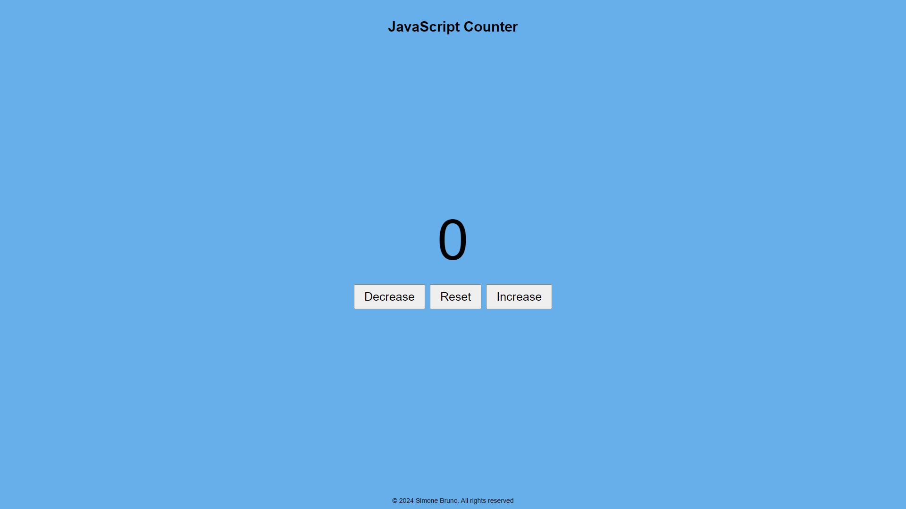

# Easy JavaScript Counter

## About The Project

Easy JavaScript Counter is a simple interactive counter application built with JavaScript and CSS. Users can easily increase, decrease, or reset the counter while enjoying a smooth user experience. This project aims to demonstrate basic JavaScript functionality and CSS styling.

## Built With

- **HTML** - For structuring the content.
- **CSS** - For styling the application.
- **JavaScript** - For interactive functionality.

## Usage

To use this project, simply click the links below. You can interact with the counter by clicking the "Increase", "Decrease", or "Reset" buttons.

### LINKS:

1. https://lincoln711.github.io/javascript-counter/
2. https://easy-javascript-counter.netlify.app/ 

## Contact

For any questions or feedback, feel free to reach out:

- **Name**: Simone Bruno
- **Email**: simonebruno433@gmail.com
- **GitHub**: [Lincon711](https://github.com/Lincoln711)
